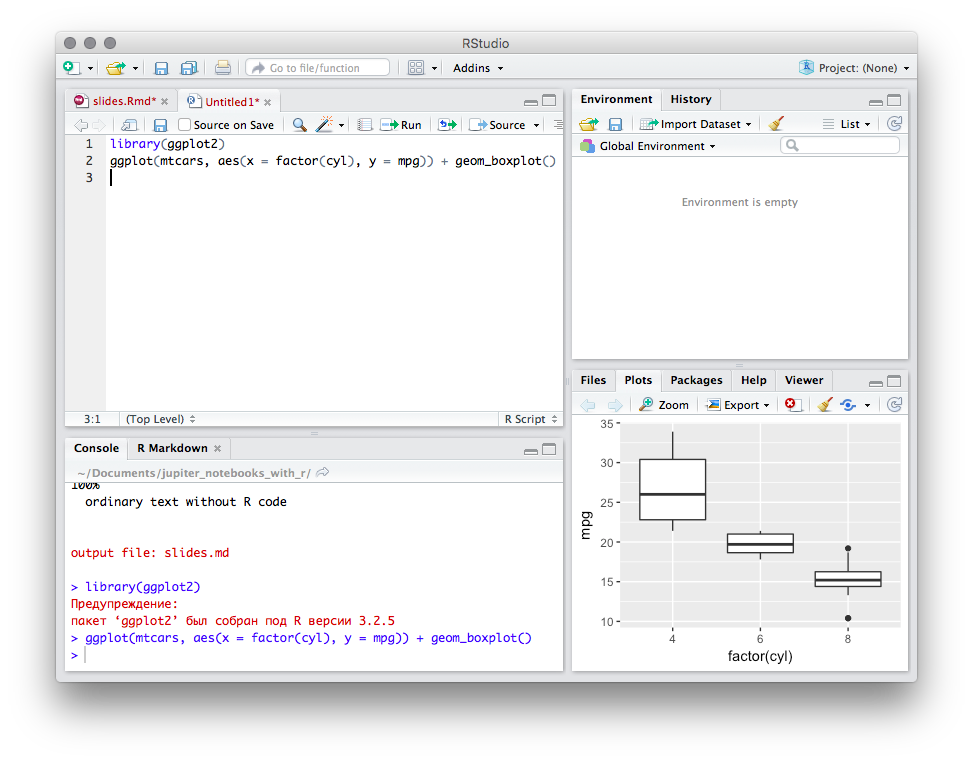
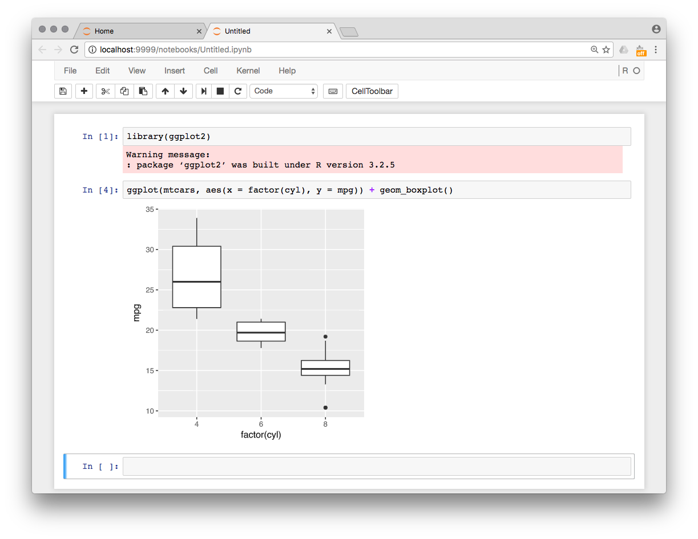
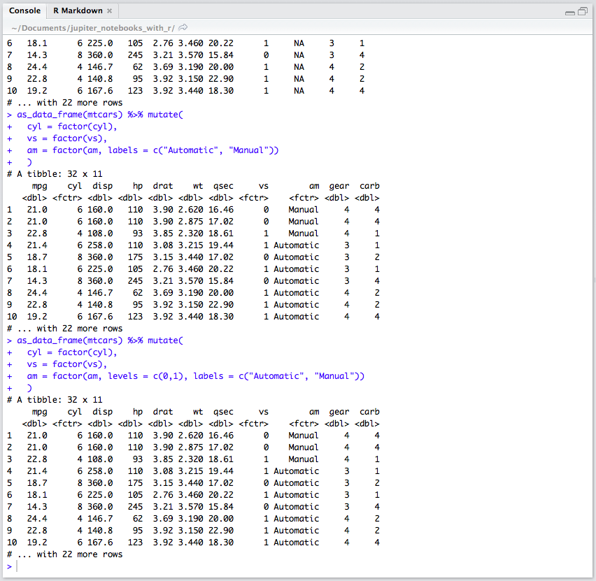
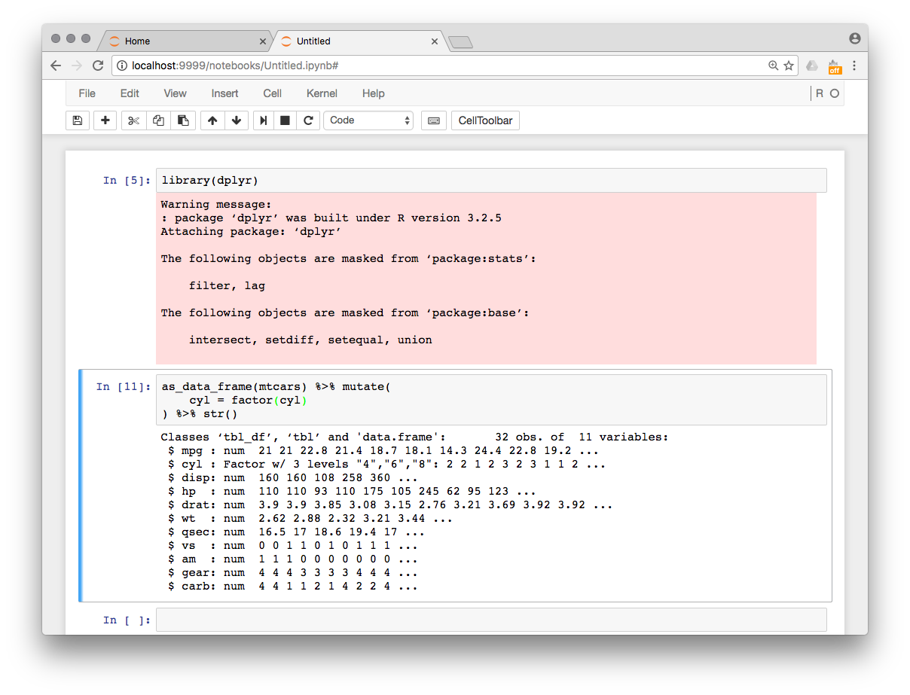
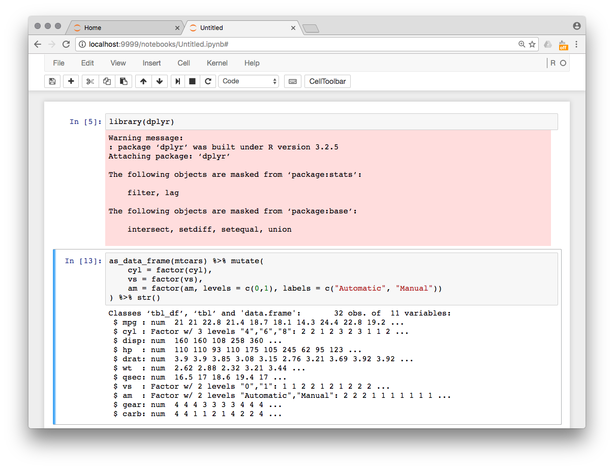

# Зачем

### Для кого:
- аналитики
- студенты / преподаватели

### Для какой задачи:
- используется интерпретируемый язык программирования
- набор данных помещается в память
- результат — отчёт <op>или код решения</op>

$\Rightarrow$ удобно использовать интерактивные сессии

--- &twocol

# Зачем

## Блокноты или IDE?

*** =left
### IDE (R Studiо)
- одна и та же сессия при выполнении скрипта и в консоли
- любую строчку скрипта можно выполнить в консоли за одно нажатие клавиш
- графики в том же окне
- многострочный ввод в консоли

*** =right
### Блокноты
- <op>одна и та же сессия при выполнении скрипта и в консоли</op>
- <op>любую строчку скрипта можно выполнить в консоли за одно нажатие клавиш</op>
- <op>графики в том же окне</op>
- <op>многострочный ввод в консоли</op>
- видимая взаимосвязь кода и его результатов
- <op>только нужный output (в противовес консоли)</op>
- <op>(almost) presentation-ready формат</op>

--- 

---

--- &twocol

# Зачем

## Блокноты или IDE?

*** =left
### IDE (R Studiо)
- одна и та же сессия при выполнении скрипта и в консоли
- любую строчку скрипта можно выполнить в консоли за одно нажатие клавиш
- графики в том же окне
- многострочный ввод в консоли

*** =right
### Блокноты
- <op>одна и та же сессия при выполнении скрипта и в консоли</op>
- <op>любую строчку скрипта можно выполнить в консоли за одно нажатие клавиш</op>
- <op>графики в том же окне</op>
- <op>многострочный ввод в консоли</op>
- <op>видимая взаимосвязь кода и его результатов</op>
- только нужный output (в противовес консоли)
- <op>(almost) presentation-ready формат</op>

---

---

---

---

--- &twocol

# Зачем

## Блокноты или IDE?

*** =left
### IDE (R Studiо)
- одна и та же сессия при выполнении скрипта и в консоли
- любую строчку скрипта можно выполнить в консоли за одно нажатие клавиш
- графики в том же окне
- многострочный ввод в консоли

*** =right
### Блокноты
- <op>одна и та же сессия при выполнении скрипта и в консоли</op>
- <op>любую строчку скрипта можно выполнить в консоли за одно нажатие клавиш</op>
- <op>графики в том же окне</op>
- <op>многострочный ввод в консоли</op>
- <op>видимая взаимосвязь кода и его результатов</op>
- <op>только нужный output (в противовес консоли)</op>
- (almost) presentation-ready формат

--- &twocol

# Зачем
Процесс подготовки отчёта:
*** =left
### IDE (R Studiо)

Console
 
$\uparrow\downarrow$
 
R Script
 
$\downarrow$
 
R Markdown

*** =right
### Блокноты

Notebook

--- &twocol

# Зачем

## Блокноты или IDE?

*** =left
### IDE (R Studiо)
- одна и та же сессия при выполнении скрипта и в консоли
- любую строчку скрипта можно выполнить в консоли за одно нажатие клавиш
- графики в том же окне
- многострочный ввод в консоли

*** =right
### Блокноты
- одна и та же сессия при выполнении скрипта и в консоли
- любую строчку скрипта можно выполнить в консоли за одно нажатие клавиш
- графики в том же окне
- многострочный ввод в консоли
- видимая взаимосвязь кода и его результатов
- только нужный output (в противовес консоли)
- (almost) presentation-ready формат

---

# Как

## Установка (Jupyter)

1. Python
2. Jupyter
2. [Зависимости для ядра](https://github.com/ipython/ipython/wiki/IPython-kernels-for-other-languages) (kernel) для нужного языка
2. Ядро Jupyter для нужного языка ([R](https://irkernel.github.io))

---

# Как

## Что могут Jupyter Notebooks
- [rich media representations ](https://nbviewer.jupyter.org/github/ipython/ipython/blob/3.x/examples/IPython%20Kernel/Rich%20Output.ipynb), из которого следуют
  - [Переопределяемое представление класса](http://ipython.readthedocs.io/en/stable/config/integrating.html)
  - Интерактивные виджеты
- Cell / line magics
  - `rpy2` — интерактивное взаимодействие между Python и R и другие удовольствия

---

# Что ещё есть
- [Beaker](http://beakernotebook.com) — интерактивное взаимодействие между R и Python через свою библиотеку
- [Sage](https://cloud.sagemath.com)
  - облачное хранилище
  - поддержка всех основных инструментов для исследовательской деятельности
  - спорный дизайн
- [R Notebook](http://rmarkdown.rstudio.com/r_notebooks.html)

